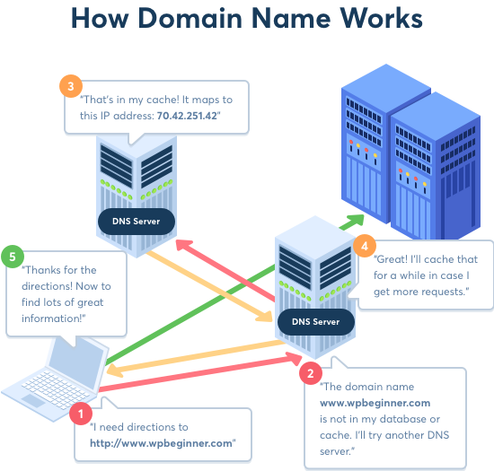

Internet-Basics
What is the Internet?
What is URL?
Uniform Resource Locator and also known as Web address.
What happens when we enter a url in browser?
- Your browser sends request when we enter address in the address bar and hit enter or go. And it is always a GET request.
- A server that recieve this request after processing it , it send backs a response.
- Server that is sending back the information or response or resource is called a web server
- You always have a client and server.
- The communcation that is happening is using HTTP protocol
- HTTP ==> Hypertext Transfer Protocol
- What is Protocol ? It is a set of rules
- What is Hypertext? It is a text that contains links to other texts.
https://www.google.com
Components of the URL
URL COmponents

HTTP and HTTPS
Http is simply the Hypertext Transfer Protocol
Https is exactly http but secure
s at the end of http referes to SSL/TLS
In https protocol first handshake is done between CLient and Server and they choose a secret language to communicate with each other. So any third person or hacker can not understand their communcation.
IP Addresses
- An Internet Protocol (IP) address is the unique identifying number assigned to every device connected to the internet.
- Google ip address http://172.217.16.78
- Ip addresse contain 4 parts
- Each part contains a num ber from 0-255
- Each part is separated with `.`
- Above one is actually IPv4 Address
- But now a days we are also using IPv6 Address
- Ipv6 looks like `2001:db8:3333:4444:5555:6666:7777:8888.`
DNS
- What it stands for?
    It stands for Domain Name Server
- What kind of record it has?
    - It stores record of Dmain Names and their respective IP addresss.

Wrap-up
- Internet
- URL = Uniform Resource Locator
- Main Components of a URL:
    - Protocol
    - Domain Name
    - Sub-domain (e.g. www/blog/etc..)
    - Top Level Domain (e.g. .com /.net/ etc.)
    - Querry ( `?` Mark)
    - Parameters starting after the `?` Mark (like color=black)
    - sub directory
    - Slug(end page that we want to access)
- IP addresses (Evey machine on Internet has Unique Ip address)
- DNS (Domain Name Servers that keeps record of domain name and its respective IP address)

-------
Tasks for Now:
Open VS code
Create a new folder named markdown-github
Inside that folder create a file mark-down.md
inside the mark-down file right below text
:smiley:
If this emoji is not working for you then install an extension in vs code markdown preview enhanced
Mark-Down:
How we Bold / Strong some text? By adding ** at start and end of the text or word. Bold

How to write a link in Markdown? [Title for the Link](# Link Itself) Ip Adress Internet Basics

Adding a Url link Mark Down Details
How to include an image inside markdown? DNS Image

:smiley:

For other emojis you can visit: Emoji Cheat Sheet

:relaxed:

Local and Remote Repositories
For remote repositories we will use today Github.
Creating a Repository on Github
What is the github - It is a portal that provides us option to create a remote repository. like gitlab and others
First we need to register and login into github.
Go to your account /Menu and then select repositories.
Then select the new in repo.
Select owner of the repo, in your case it will give only one option that is your account
Provide a name of your repot , Please dont use spaces.
Then click the create repository button
We will talk about two ways of creating the remote repo
Be careful to select the ssh if you have SSH key configured other wise you can use https also.
In first option just copy the link of the repo from quick setup option
to clone the repo from github we need to run the command git clone copied-link-from-github
After clonining the repo from github, a folder will be created with name of the repo.
open that folder with vs code
Make your changes like adding a new file/folders modifying a file.
we need to make our changes ready for staging
to stage it we need to run the command git add ., to stage all changes.
then commit your changes in local repo git commit -m gitmessage
then our local repo will have record of our commit but remote repo is not aware of the changes.
To update the remote repo we need to push our work git push